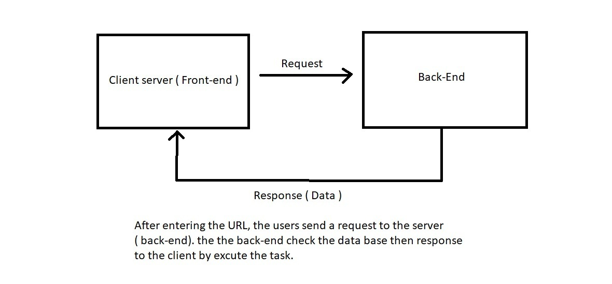

# city-explorer-api


**Author**: Ibrahim Abu-awad
**Version**: 2.0.0 

## Overview

#### this application talk about make my own API and run it with my frontend 

## Getting Started

#### just take the code and put it in your machine for now

## Architecture

 #### So we work this app by react library and use ofcourse React-bootstrap for designing also using an API from locationIQ with axiox to handle the API also cors

## Change Log

#### 03-05-2021 7:00pm - Application now has a my own API 
#### 05-05-2021 7:00pm - Application get information from another APIs
#### 08-05-2021 7:00pm - Application now has a fully-functional express server, with a GET route for the location resource.

## Credit and Collaborations

1. https://www.axios.com/  
2. https://locationiq.com/





```
Name of feature: made my own API weather

Estimate of time needed to complete: 3 hours

Start time: 7:00 PM

Finish time: 10:00 PM

Actual time needed to complete: 3 hours

```

```
Name of feature: get info from 2 API's

Estimate of time needed to complete: 5 hours

Start time: 4:00 PM

Finish time: 10:00 PM

Actual time needed to complete: 6 hours

```

```
Name of feature: refactor 

Estimate of time needed to complete: 1 hour

Start time: 4:00 PM

Finish time: 5:00 PM

Actual time needed to complete: 1 hour

```

```
Name of feature: add cache memory 

Estimate of time needed to complete: 1 hour

Start time: 4:00 PM

Finish time: 5:00 PM

Actual time needed to complete: 1 hour

```
